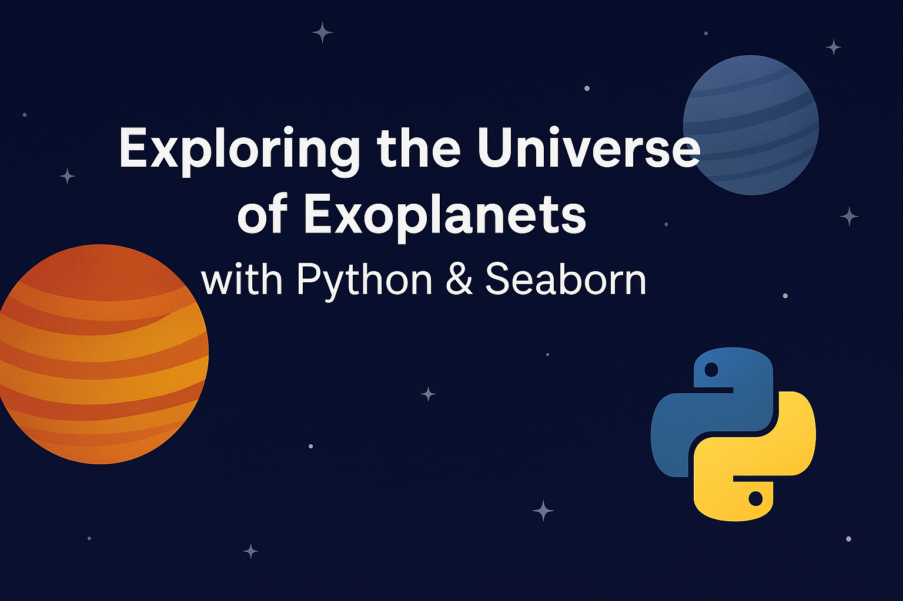

  

# Exoplanet-Visualization-Python

## Overview
This project uses Python and Seaborn to analyze and visualize data on exoplanet discoveries. It highlights trends in detection methods, planetary mass, orbital periods, and system sizes.

## Key Visualizations
- 📈 Discovery methods over time
- 🌍 Distance from Earth vs discovery year
- 🔄 Orbital period trends
- ⚖️ Mass distribution of exoplanets
- 🔗 Pairplot of key features
- 🪐 Minimum mass by system size
- 📊 Distribution of system sizes

## Tools Used
- Python
- Pandas
- Seaborn
- Matplotlib
- Jupyter Notebook

## How to Run
1. Clone the repo
2. Install dependencies: `pip install -r requirements.txt`
3. Launch the notebook: `jupyter notebook notebooks/exoplanet_analysis.ipynb`

## Author
Munawer — Data Analyst passionate about uncovering insights through visualization and storytelling.
